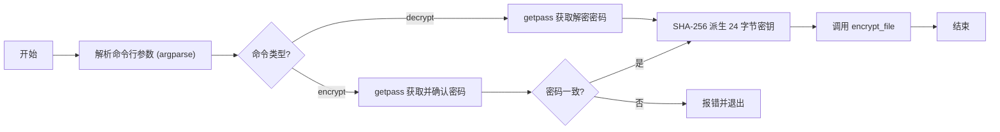
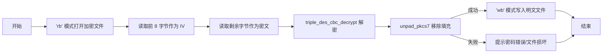
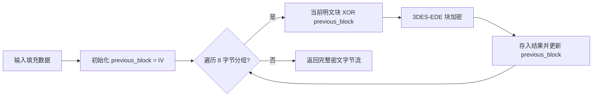
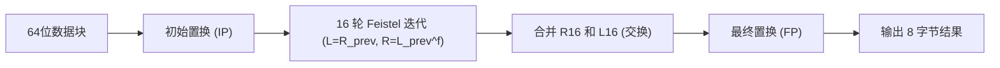

```mermaid
graph LR
    A[开始] --> B["解析命令行参数 (argparse)"]
    B --> C{命令类型?}
    C -- encrypt --> D["getpass 获取并确认密码"]
    D --> E{密码一致?}
    E -- 是 --> F["SHA-256 派生 24 字节密钥"]
    F --> G["调用 encrypt_file"]
    G --> Z[结束]
    E -- 否 --> H[报错并退出]
    C -- decrypt --> I["getpass 获取解密密码"]
    I --> F
```

```mermaid
graph LR
    A[开始] --> B["os.urandom 生成 8 字节 IV"]
    B --> C["'rb' 模式读取原始文件"]
    C --> D["pad_pkcs7 执行填充"]
    D --> E["triple_des_cbc_encrypt 加密"]
    E --> F["'wb' 模式打开目标文件"]
    F --> G["写入 8 字节 IV"]
    G --> H["续写全部密文块"]
    H --> Z[结束]
```

```mermaid
graph LR
    A[开始] --> B["'rb' 模式打开加密文件"]
    B --> C["读取前 8 字节作为 IV"]
    C --> D["读取剩余字节作为密文"]
    D --> E["triple_des_cbc_decrypt 解密"]
    E --> F["unpad_pkcs7 移除填充"]
    F -- 成功 --> G["'wb' 模式写入明文文件"]
    F -- 失败 --> H["提示密码错误/文件损坏"]
    G --> Z[结束]
    H --> Z
```

```mermaid
graph LR
    A[输入填充数据] --> B["初始化 previous_block = IV"]
    B --> C{"遍历 8 字节分组?"}
    C -- 是 --> D["当前明文块 XOR previous_block"]
    D --> E["3DES-EDE 块加密"]
    E --> F["存入结果并更新 previous_block"]
    F --> C
    C -- 否 --> G[返回完整密文字节流]
```

```mermaid
graph LR
    A[64位数据块] --> B["初始置换 (IP)"]
    B --> C["16 轮 Feistel 迭代 (L=R_prev, R=L_prev^f)"]
    C --> D["合并 R16 和 L16 (交换)"]
    D --> E["最终置换 (FP)"]
    E --> F["输出 8 字节结果"]
```