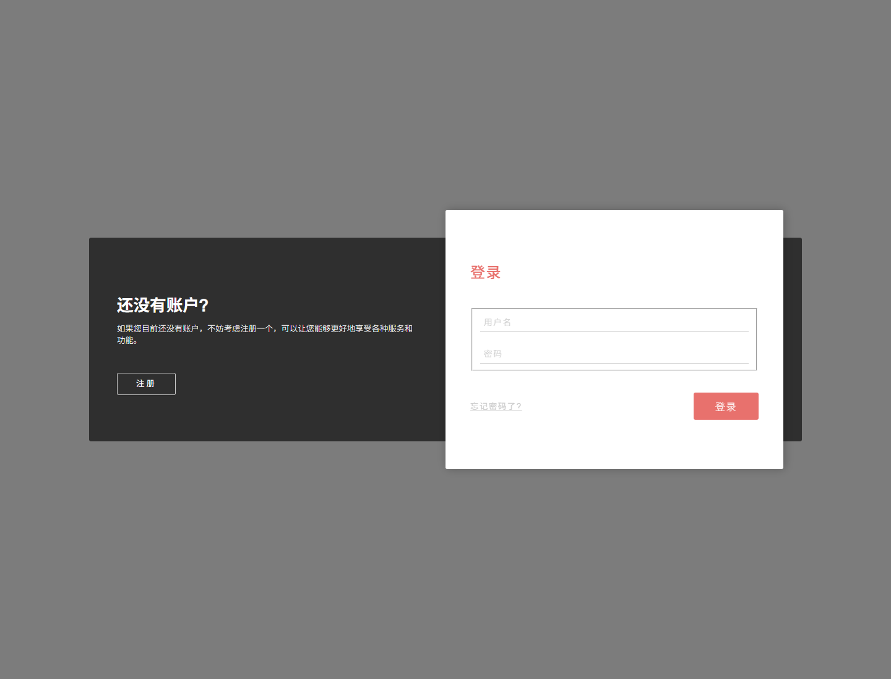
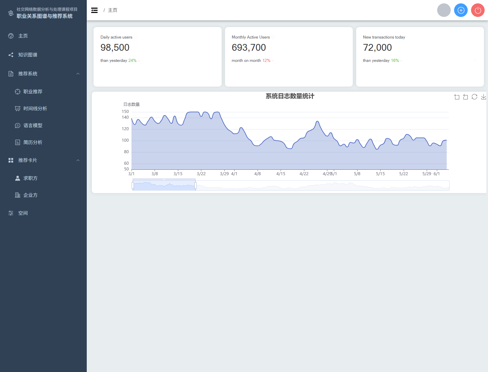
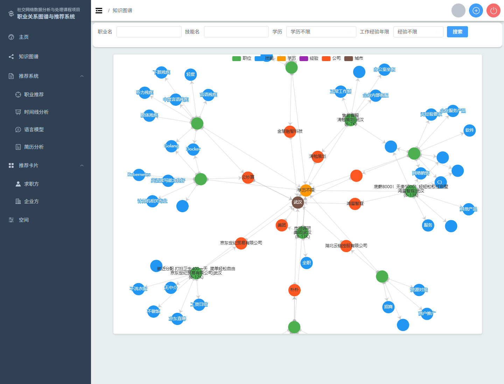
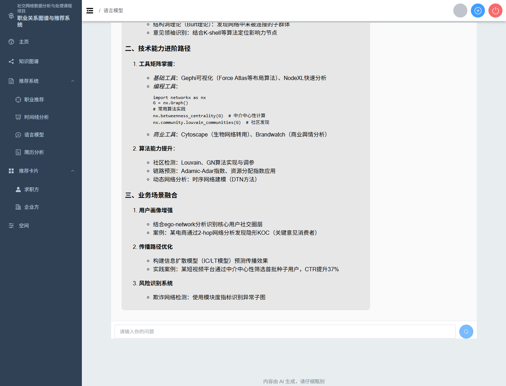
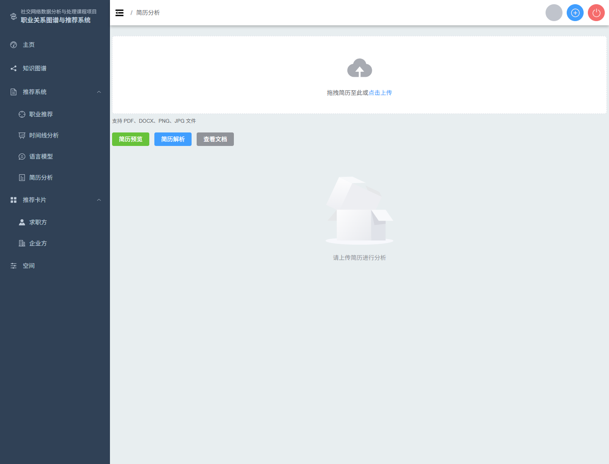
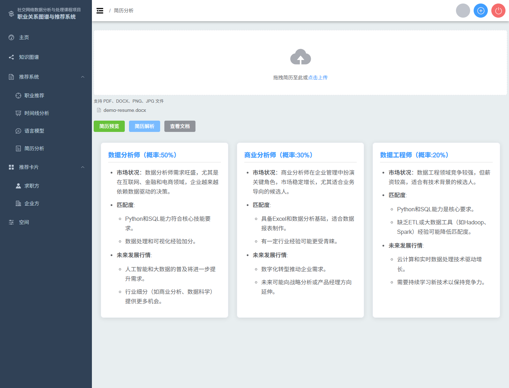

# 社交网络数据分析与处理课程项目演示简报

整理时间：2026-06-21

## 1. 项目定位

本项目可以理解为一个“面向就业场景的关系网络分析与职业推荐系统”。它把岗位、公司、城市、技能、学历、经验等信息组织成图谱，再结合检索、推荐和大语言模型问答，帮助用户从招聘数据中理解职业要求和发展路径。

如果放到课程汇报里，可以把它概括为：

- 数据层：从岗位数据中抽取实体和关系。
- 图谱层：用 Neo4j 建立岗位-技能-学历-经验-公司-城市之间的关系网络。
- 应用层：提供知识图谱查询、职业推荐、职业时间线分析、AI 问答和简历分析。
- 展示层：用 Vue + Element Plus + ECharts 做前端交互和可视化。

## 2. 本地演示状态

本轮已经跑通本地演示闭环，当前本机服务状态如下：

| 模块 | 端口 | 作用 |
| --- | --- | --- |
| MySQL | 3413 | 保存用户、角色、岗位卡片等业务数据 |
| Redis | 6379 | 后端缓存/会话相关依赖 |
| Neo4j | 7474 / 7687 | 保存职业知识图谱 |
| Flask | 8080 | 提供图谱检索、推荐、AI 问答、时间线和简历分析接口 |
| Spring Boot | 8090 | 提供注册登录、用户信息、上传、岗位卡片等业务接口 |
| Vite 前端 | 8089 | 浏览器演示入口 |

构建和接口验证：

- 前端 `npm run build` 已通过。
- 后端 `mvnw.cmd compile` 已通过。
- `/user/register`、`/user/login` 已能完成注册登录并返回菜单路由。
- `/api/search`、`/api/recommend` 已返回岗位列表和图谱数据。
- `/api/analyze`、`/api/ask`、`/api/upload` 已能返回 AI 分析结果。

说明：Maven 构建过程中仍有项目原有的 POM warning，Vite 构建也有大 chunk warning，但不影响本地演示。

## 3. 数据源与图谱建模

本轮演示使用的数据来自项目内置岗位样本表 `JobRec_Front/Backend/function/bossData.xlsx`。从项目文件看，`function/demo.py` 会读取该 Excel 并导入 MySQL 的 `jobSys` 表，`JobRec_Back/jobrec.sql` 中也保存了对应的 803 条岗位插入记录。因此，本项目中可追溯的数据源是这个本地 Excel/SQL 岗位样本，而不是在线实时接口。

需要说明的是，项目没有附带原始爬虫脚本、采集时间、采集 URL 或平台授权说明。文件名 `bossData.xlsx` 和岗位内容显示它很像从招聘平台整理的岗位信息，可能与 BOSS 直聘风格数据有关，但在汇报中不建议直接说成“BOSS 直聘官方数据集”。更稳妥的表述是：

> 本项目使用项目内置的招聘岗位样本数据，共 803 条，字段包括职位、城市、公司、学历、经验、技能、薪资、福利、工作描述和行业。数据用于课程项目演示与知识图谱建模，不代表完整招聘市场。

该文件字段包括：

- 职位
- 城市
- 公司
- 学历
- 经验
- 技能
- 薪资
- 福利
- 工作描述
- 行业

演示时已将表格中的 803 条岗位记录完整导入本地 Neo4j。导入后的图谱包含以下实体：

- `Job`：岗位
- `Company`：公司
- `City`：城市
- `Skill`：技能
- `Degree`：学历
- `Experience`：经验

主要关系包括：

- 岗位需要某项技能：`Job -> Skill`
- 岗位要求某种学历：`Job -> Degree`
- 岗位要求某段经验：`Job -> Experience`
- 岗位属于某家公司：`Job -> Company`
- 公司位于某个城市：`Company -> City`

这批数据全部为武汉地区岗位，行业主要覆盖互联网、人工智能、大数据、游戏、电子商务、云计算等方向。它适合课程演示和功能验证，但仍不能代表完整招聘市场分布。PPT 中建议把它称为“岗位样本数据集”或“课程演示数据集”。

## 4. 推荐算法说明

本项目当前的推荐核心不是传统协同过滤，也不是矩阵分解模型，而是“自然语言解析 + 知识图谱条件匹配 + Top-K 排序”的推荐流程。参考项目中的推荐系统实验代码使用了矩阵分解思想，把用户-物品交互矩阵分解为隐向量后做 Top-K 推荐；本项目没有用户评分矩阵，因此更适合使用岗位知识图谱进行内容匹配和可解释推荐。

当前职业推荐流程如下：

1. 用户在前端输入自我描述，例如“熟悉 Java、Spring、Vue、MySQL，本科学历”。
2. Flask 后端调用 `KG_processing.py`，用规则和关键词从自然语言中抽取技能和学历。
3. `KG_answer.py` 根据技能、学历、经验和薪资条件拼接 Neo4j 查询。
4. 查询岗位节点及其关联的公司、城市、技能、学历、经验节点。
5. 对候选岗位计算匹配分数，并按分数排序取 Top-K。
6. 前端同时展示推荐表格和图谱解释。

当前匹配分数主要由三部分组成：

```text
match_count =
  命中的技能数量
  + 学历是否匹配
  + 经验是否匹配
```

这个算法的优点是可解释性强。推荐结果不仅告诉用户“推荐了哪些岗位”，还可以通过图谱展示“岗位为什么和这些技能、学历、经验有关”。它的不足是语义理解较浅，主要依赖关键词命中，暂时没有学习用户偏好，也没有使用复杂的排序模型。

可以在 PPT 中这样讲：

> 本项目推荐算法采用图谱匹配思路。系统先从用户输入中提取技能和学历，再到 Neo4j 中查找满足条件的岗位，并根据技能命中、学历匹配和经验匹配计算排序分数。相比黑盒推荐，这种方法更容易解释推荐原因，适合课程项目展示知识图谱在推荐系统中的应用。

## 5. 技术栈与主要公用库

### 前端

前端使用 Vue 3 + Vite 构建，主要负责页面路由、表单输入、表格展示、图谱可视化和文件上传交互。

主要库：

- `vue`：前端框架。
- `vue-router`：页面路由和登录后动态菜单。
- `element-plus`：UI 组件库，用于菜单、表格、表单、按钮、上传、时间线等组件。
- `@element-plus/icons-vue`：图标库。
- `axios`：调用 Spring Boot 业务接口。
- `echarts`：绘制知识图谱和推荐结果关系网络。
- `marked`、`markdown-it`、`markdown-it-katex`：把 AI 返回的 Markdown 内容渲染到页面。
- `mammoth`：前端预览 Word 简历内容。
- `jwt-decode`：解析登录 token。

### Spring Boot 后端

Spring Boot 主要负责传统业务接口，包括注册登录、用户信息、上传、简历/头像访问、职位卡片等。

主要库：

- `spring-boot-starter-web`：提供 REST API。
- `mybatis-plus-spring-boot3-starter`：访问 MySQL 业务表。
- `mysql-connector-j`：MySQL 连接。
- `druid-spring-boot-starter`：数据库连接池。
- `spring-boot-starter-data-redis`、`jedis`：Redis 支持。
- `jjwt`：JWT token 生成与解析。
- `argon2-jvm`：密码哈希。
- `lombok`：减少 Java 实体和 DTO 的样板代码。

### Flask / Python 后端

Flask 主要负责数据分析和 AI 相关能力，包括知识图谱查询、推荐、职业时间线、AI 问答和简历分析。

主要库和模块：

- `Flask`：提供 `/api/*` 接口。
- `flask-cors`：处理跨域。
- `openai`：使用 OpenAI 兼容 SDK 调用外部大语言模型服务。
- `py2neo` 或 Neo4j 相关连接模块：查询图数据库。
- `pandas`：读取和处理表格数据。
- `PyMuPDF` / `fitz`：提取 PDF 简历文本。
- `python-docx`：提取 Word 简历文本。
- `Pillow`、`pytesseract`、`pdf2image`：处理图片或扫描版文件的 OCR 场景。

## 6. 语言模型是如何实现的

本项目没有在本地训练大模型，而是通过 Flask 后端调用外部大语言模型服务。当前代码使用的是 OpenAI 兼容 SDK，但供应商地址配置为 SiliconFlow，而不是 DeepSeek 官方 API 地址。实现方式是：

1. Flask 后端初始化 OpenAI 兼容客户端。
2. 配置 SiliconFlow 的 `base_url` 和本地 API key。
3. 在功能模块中传入模型标识；当前代码写的是 `deepseek-ai/DeepSeek-V3`。
4. 不同功能模块用不同 prompt 组织输入和输出格式。

对应文件和功能：

| 文件 | 类/函数 | 功能 |
| --- | --- | --- |
| `Backend/function/resume_parser.py` | `CareerCounselor.answer_question` | AI 问答，使用流式响应返回答案 |
| `Backend/function/career_analyzer.py` | `CareerTimelineAnalyzer.analyze_career_timeline` | 根据职业名生成职业发展时间线 |
| `Backend/function/job_rec.py` | `JobRecommender.jobRecommender` | 根据简历文本生成职业匹配建议 |
| `Backend/app.py` | `/api/ask`、`/api/analyze`、`/api/upload` | 对外暴露 AI 功能接口 |

可以在 PPT 中这样讲：

> 本项目的大语言模型能力不是单独训练的，而是通过 OpenAI 兼容接口接入第三方模型服务。当前本地代码使用 SiliconFlow 平台地址，并在代码中配置了 `deepseek-ai/DeepSeek-V3` 这一模型标识。由于模型平台会调整可用模型，正式汇报时建议表述为“接入 OpenAI 兼容的大模型服务”，不要说成“调用 DeepSeek 官方 API”。我们把职业时间线、AI 问答和简历分析拆成不同 prompt 模板，让模型按 Markdown 格式输出，再由前端渲染成时间线、问答和分析卡片。

需要注意：

- 当前 API key 仍在本地源码配置中，适合本机演示，不适合公开提交。后续应该迁移到环境变量。
- `deepseek-ai/DeepSeek-V3` 是当前代码中配置的 SiliconFlow 模型标识，不等同于 DeepSeek 官方 API 的当前推荐模型名。
- 如果后续改用 DeepSeek 官方 API，应同步修改 `base_url`、模型名称和密钥来源；如果继续使用 SiliconFlow，应以 SiliconFlow 模型广场当前可用模型为准。

## 7. UI 设计说明

系统 UI 更接近后台管理和数据分析工具，而不是营销型网站。整体设计目标是让用户能快速进入功能页、输入条件、查看表格和图谱结果。

主要设计特点：

- 左侧深色导航栏：按功能分组，包括主页、知识图谱、推荐系统、推荐卡片、空间等。
- 顶部工具栏：保留折叠菜单、全屏、退出等操作入口。
- 主内容区：每个功能页面用表单作为输入入口，下方展示结果。
- 知识图谱页：顶部是筛选条件，下方是 ECharts 力导向图。
- 推荐页：上方输入自我描述，中间是岗位推荐表，下方是推荐关系图。
- 时间线页：输入职业名后，用时间线组件展示职业阶段、背景、关键事件和技能要求。
- AI 问答页：采用聊天界面，用户问题在右侧，AI 回答在左侧。
- 简历分析页：采用上传组件和三列分析卡片，方便截图展示。

### 关于系统标题

UI 左上角已经改为“社交网络数据分析与处理课程项目：职业关系图谱与推荐系统”。这样更能突出课程作业属性，也避免让听众误以为这是学校官方平台、公司产品或独立商业系统。

标题分成两层展示：

- 第一层：“社交网络数据分析与处理课程项目”，强调课程来源。
- 第二层：“职业关系图谱与推荐系统”，说明系统主题。

PPT 中建议沿用这个标题，汇报时可以说：“我们小组围绕招聘岗位数据构建职业关系图谱，并在此基础上完成岗位推荐和 AI 辅助分析。”

## 8. 截图素材与功能说明

截图目录：`docs/screenshots/`

### 00-login.png：登录入口

文件：`docs/screenshots/00-login.png`



展示系统登录页，用于说明前端项目可以正常加载，并支持用户进入后续功能。

适合 PPT 位置：系统入口或演示流程第一页。

### 01-dashboard.png：首页仪表盘

文件：`docs/screenshots/01-dashboard.png`



展示登录后的主框架，包括左侧导航、顶部工具栏和首页统计面板。

注意：首页统计数字目前偏模板展示，未完全接入真实业务统计。PPT 中建议主要用它说明系统导航结构，不要把数字当成真实业务结论。

### 02-knowledge-graph.png：知识图谱查询

文件：`docs/screenshots/02-knowledge-graph.png`



展示岗位、技能、学历、经验、公司和城市之间的图谱关系。节点颜色代表不同实体类型，连线表示实体之间的关系。

适合 PPT 讲法：

> 这里把招聘数据转成图结构，可以看到岗位与技能、学历、经验、公司、城市之间的连接关系。相比单纯表格，图谱更适合解释岗位要求之间的关联。

### 03-career-recommendation.png：职业推荐

文件：`docs/screenshots/03-career-recommendation.png`


展示用户输入技能和背景描述后，系统返回推荐岗位表格，并同步生成岗位关系图。

推荐页体现了两个点：

- 表格结果便于查看岗位、薪资、技能要求、学历、经验、公司等信息。
- 图谱结果便于解释推荐岗位和技能之间的关系。

### 04-career-timeline.png：职业时间线分析

文件：`docs/screenshots/04-career-timeline.png`


展示输入“数据分析师”后，AI 生成的职业发展阶段分析。内容包括阶段名称、背景、关键事件和技能要求。

适合 PPT 讲法：

> 时间线分析是 AI 模块的应用之一，它把职业发展过程拆成阶段，帮助用户理解一个方向过去和未来需要关注的能力变化。

### 05-ai-chat.png：AI 问答

文件：`docs/screenshots/05-ai-chat.png`



展示用户围绕社交网络分析能力提出问题后，AI 返回的解释性回答。

适合 PPT 讲法：

> 该功能提供自然语言交互入口，用户可以追问职业发展、技能学习或社交网络分析方法。AI 回答以 Markdown 渲染，便于阅读。

### 06-resume-upload.png：简历上传入口

文件：`docs/screenshots/06-resume-upload.png`



展示简历分析功能的上传入口。本轮使用虚拟演示简历，不展示真实个人信息。

适合 PPT 位置：应用场景拓展或简历分析流程页。

### 07-resume-analysis.png：简历分析结果

文件：`docs/screenshots/07-resume-analysis.png`



展示上传虚拟简历后，系统给出的职业匹配建议。结果以卡片形式展示，每张卡片包含职业名称、概率、市场状况、匹配度和发展行情。

适合 PPT 讲法：

> 简历分析把系统从“查岗位”扩展到了“根据个人材料给职业建议”。这部分由 Flask 提取简历文本，再交给语言模型生成职业匹配分析。

## 9. 可以放进 PPT 的核心结论

1. 项目已经形成了一个完整的本地演示闭环，可以完成注册登录、知识图谱展示、职业推荐、时间线分析、AI 问答和简历分析。

2. 推荐算法采用“用户输入解析 + 图谱条件匹配 + Top-K 排序”的思路。系统不只是返回岗位列表，还能展示岗位与技能、学历、经验、公司、城市之间的关系，因此推荐结果具有一定可解释性。

3. 大语言模型补充了传统图谱查询的不足。图谱更适合处理结构化关系，AI 更适合生成职业发展解释、问答和简历分析建议。

4. 前端采用后台式信息架构，适合课程演示中的功能切换和结果截图。ECharts 图谱、Element Plus 表格/时间线/上传组件共同支撑了主要交互。

5. 当前数据规模仍偏小，推荐逻辑主要基于技能和条件匹配，后续可以继续扩充数据、清洗技能同义词，并加入更明确的匹配评分。

## 10. 当前不足与风险

- 岗位数据已经完整导入 803 条样本，但仍属于课程演示数据，规模和覆盖范围有限。
- 首页统计面板还没有完全接入真实业务指标。
- AI 接口依赖外部模型服务，响应速度和输出格式存在波动。
- 推荐结果目前更偏关键词和图谱关系匹配，语义匹配与评分机制仍可增强。
- 项目本地运行依赖 MySQL、Redis、Neo4j、Flask、Spring Boot、Vite 多个服务，复现成本偏高。
- 源码中仍存在硬编码敏感配置，适合本地演示，但不适合公开提交或分发。
- 部分接口鉴权和上传安全边界仍需加强。

## 11. 后续开发建议

短期优先保证交付物：

- 用当前截图和本文档制作 PPT，避免临场依赖 AI 输出。
- 保留“演示数据集”的说明，避免把小样本说成完整市场结论。
- 如果需要提交代码，先清理运行产物并补 `.gitignore`。

中期提升系统质量：

- 增加 Neo4j 演示数据导入脚本，方便组员复现。
- 给推荐结果增加匹配评分，例如技能匹配数、学历匹配、经验匹配、薪资匹配。
- 做技能同义词清洗，例如 JavaScript/js、Python/py、Spring/Spring Boot。
- 首页仪表盘接入真实统计数据，如岗位数量、技能热度、公司数量。

长期完善工程化：

- 将 API key、数据库密码、JWT 密钥迁移到环境变量。
- 收紧后端鉴权，只放行登录和注册接口。
- 修复 Flask 上传路径安全问题，使用随机文件名或安全文件名。
- 准备 Docker Compose 或一键启动脚本，降低复现成本。
