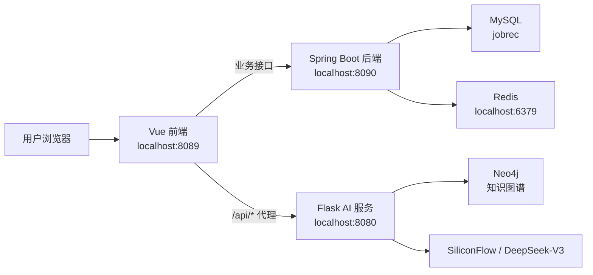

# 智能职位推荐系统技术文档

## 1. 项目概述

本项目是一个面向求职与招聘场景的智能职位推荐系统，核心目标是通过职位数据、用户求职信息、知识图谱检索和大语言模型能力，为用户提供职位浏览、职位推荐、简历解析、AI 职业问答和职业发展路径分析等功能。

系统采用三服务协作架构：

- `JobRec_Back`：Spring Boot 后端服务，负责用户、角色菜单、职位卡片、求职卡片、企业信息、候选人信息、文件上传等业务能力。
- `JobRec_Front`：Vue 3 前端应用，负责页面展示、登录流程、动态菜单、职位详情、推荐结果、AI 问答和个人中心等交互。
- `JobRec_Front/Backend`：Flask AI 服务，负责知识图谱职位检索、推荐、简历解析、AI 职业问答和职业时间线分析。

## 2. 技术栈

### 2.1 后端服务

目录：`JobRec_Back`

| 分类 | 技术 |
| --- | --- |
| 语言 | Java 17 |
| 框架 | Spring Boot 3.4.5 |
| ORM | MyBatis-Plus 3.5.5 |
| 数据库 | MySQL 8.0+ |
| 缓存 | Redis |
| 连接池 | Druid |
| 认证 | JWT |
| 密码哈希 | Argon2 |
| 构建工具 | Maven |

### 2.2 前端应用

目录：`JobRec_Front`

| 分类 | 技术 |
| --- | --- |
| 框架 | Vue 3 |
| 构建工具 | Vite 6 |
| UI 组件库 | Element Plus |
| 状态管理 | Pinia |
| 路由 | Vue Router |
| HTTP 客户端 | Axios |
| 图表 | ECharts |
| 富文本/Markdown | marked、markdown-it、katex |
| 文件处理 | mammoth、vue-cropper |

### 2.3 AI 服务

目录：`JobRec_Front/Backend`

| 分类 | 技术 |
| --- | --- |
| 语言 | Python |
| Web 框架 | Flask |
| 跨域 | Flask-Cors |
| 大模型接口 | OpenAI SDK，连接 SiliconFlow 兼容接口 |
| 知识图谱 | py2neo / Neo4j |
| 文档解析 | PyMuPDF、python-docx |
| OCR | Pillow、pytesseract、pdf2image |
| NLP / ML | transformers、torch |

## 3. 总体架构



系统中存在两条主要后端链路：

- 业务链路：前端通过 Axios 调用 Spring Boot，处理登录、用户资料、职位卡片、菜单、文件上传等。
- AI 链路：前端通过 Vite 代理将 `/api/*` 请求转发给 Flask，处理推荐、搜索、简历解析、AI 问答和职业时间线。

## 4. 目录结构

```text
project/
├── JobRec_Back/                  # Java Spring Boot 后端
│   ├── pom.xml
│   ├── jobrec.sql                # MySQL 初始化脚本
│   └── src/main/
│       ├── java/com/project/yuhangvue/
│       │   ├── controller/       # REST 接口层
│       │   ├── service/          # 业务接口
│       │   ├── service/Impl/     # 业务实现
│       │   ├── mapper/           # MyBatis-Plus Mapper
│       │   ├── entity/           # 数据实体
│       │   ├── dto/              # 数据传输对象
│       │   ├── config/           # Web、Redis、MyBatis、CORS 配置
│       │   ├── interceptor/      # JWT 登录拦截器
│       │   ├── utils/            # JWT、密码、Base64 等工具
│       │   ├── common/           # 统一响应 Result
│       │   └── exception/        # 异常处理
│       └── resources/
│           ├── application.yml
│           └── static/
├── JobRec_Front/                 # Vue 前端
│   ├── package.json
│   ├── vite.config.js
│   ├── src/
│   │   ├── main.js
│   │   ├── App.vue
│   │   ├── router/index.js       # 静态路由 + 动态菜单路由
│   │   ├── utils/axios.js        # Axios 实例与拦截器
│   │   ├── stores/index.js       # Pinia store
│   │   ├── views/Home.vue        # 主布局
│   │   └── components/           # 页面组件
│   └── Backend/                  # Flask AI 服务
│       ├── app.py
│       ├── requirements.txt
│       ├── KG_processing.py
│       ├── KG_search.py
│       ├── KG_answer.py
│       ├── upload.py
│       └── function/
│           ├── job_rec.py
│           ├── resume_parser.py
│           ├── career_analyzer.py
│           └── model_1.py
├── docs/                         # 项目文档和截图
└── reference/                    # 课程参考资料
```

## 5. 后端服务设计

### 5.1 后端职责

Spring Boot 后端负责系统的核心业务数据管理：

- 用户登录、注册、密码修改、头像更新。
- 根据用户角色返回菜单。
- 职位卡片分页、详情、企业职位发布信息维护。
- 求职者卡片分页、求职信息维护。
- 候选人和企业用户资料维护。
- 简历、头像等文件上传。
- JWT 登录校验和统一响应封装。

### 5.2 分层说明

| 层级 | 目录 | 说明 |
| --- | --- | --- |
| 接口层 | `controller` | 接收 HTTP 请求，校验参数，调用服务层 |
| 服务层 | `service` / `service/Impl` | 承载业务逻辑 |
| 数据访问层 | `mapper` | 使用 MyBatis-Plus 操作数据库 |
| 实体层 | `entity` | 对应数据库表结构 |
| DTO 层 | `dto` | 接收前端请求或返回组合数据 |
| 配置层 | `config` | Web、Redis、MyBatis-Plus、跨域等配置 |
| 拦截器 | `interceptor` | JWT 鉴权 |
| 公共能力 | `common` / `utils` / `exception` | 响应、工具和异常处理 |

### 5.3 统一响应格式

后端使用 `Result<T>` 封装响应：

```json
{
  "code": 200,
  "message": "操作成功",
  "data": {}
}
```

常见状态：

| code | 含义 |
| --- | --- |
| 200 | 成功 |
| 401 | 未登录或 Token 无效 |
| 500 | 业务失败或服务器异常 |

### 5.4 JWT 认证

认证工具位于 `utils/JwtUtil.java`，登录成功后生成 JWT，包含以下关键信息：

- `id`：用户 ID。
- `nickname`：用户昵称。
- `avatar`：头像地址。
- `exp`：过期时间。

拦截器位于 `interceptor/LoginInterceptor.java`。除 `/user/**`、`/avatar/**`、`/resume/**` 等路径外，其余后端接口默认需要请求头携带：

```http
Authorization: <token>
```

前端在 `src/utils/axios.js` 中自动从 `localStorage.token` 读取 token 并附加到请求头。

## 6. 后端接口概览

### 6.1 用户接口

基础路径：`/user`

| 方法 | 路径 | 说明 |
| --- | --- | --- |
| POST | `/login` | 用户登录 |
| POST | `/register` | 用户注册 |
| POST | `/updatePassword` | 修改密码 |
| POST | `/updateAvatar` | 更新头像地址 |
| POST | `/getInfo` | 获取用户信息 |

### 6.2 菜单接口

基础路径：`/menu`

| 方法 | 路径 | 说明 |
| --- | --- | --- |
| POST | `/getMenu` | 根据用户 ID 获取菜单列表 |

菜单数据会被前端写入 `localStorage.menus`，并用于动态生成路由。

### 6.3 职位接口

基础路径：`/job`

| 方法 | 路径 | 说明 |
| --- | --- | --- |
| POST | `/page` | 职位分页查询 |
| GET | `/detail/{id}` | 获取职位详情 |
| POST | `/update` | 新增或更新企业职位卡片 |
| POST | `/getInfo` | 获取企业关联的职位信息 |

### 6.4 求职卡片接口

基础路径：`/seekcard`

| 方法 | 路径 | 说明 |
| --- | --- | --- |
| POST | `/page` | 求职卡片分页查询 |
| POST | `/update` | 新增或更新求职者卡片 |
| POST | `/getInfo` | 获取求职者卡片详情 |

### 6.5 候选人接口

基础路径：`/candidate`

| 方法 | 路径 | 说明 |
| --- | --- | --- |
| POST | `/updateInfo` | 更新候选人资料 |
| POST | `/getInfo` | 获取候选人资料 |

### 6.6 企业接口

基础路径：`/firm`

| 方法 | 路径 | 说明 |
| --- | --- | --- |
| POST | `/updateInfo` | 更新企业用户资料 |
| POST | `/getInfo` | 获取企业用户资料 |

### 6.7 文件接口

基础路径：`/file`

| 方法 | 路径 | 说明 |
| --- | --- | --- |
| POST | `/upload` | 上传简历文件 |
| POST | `/uploadAvatar` | 上传头像文件 |

文件保存位置：

- 简历：`uploaded-files/resume`
- 头像：`uploaded-files/images/uploads`

静态访问路径由 `config/WebConfig.java` 映射到 `/resume/**` 和 `/avatar/**`。

## 7. 前端应用设计

### 7.1 前端职责

Vue 前端负责以下页面和交互：

- 登录、角色选择、注册/身份入口。
- 后台主布局、侧边菜单、面包屑和路由承载。
- 仪表盘展示。
- 职位列表、候选人/企业卡片、职位详情。
- 知识图谱职位搜索。
- AI 职业问答。
- 简历上传与解析推荐。
- 职业发展时间线分析。
- 个人中心、头像裁剪、资料维护、密码修改。

### 7.2 入口与插件

入口文件：`src/main.js`

应用初始化时注册：

- Element Plus。
- Element Plus Icons。
- Pinia。
- Vue Router。
- vue3-particles。
- vue-cropper。

全局样式位于：

- `src/assets/base.css`
- `src/assets/main.scss`

### 7.3 路由设计

路由文件：`src/router/index.js`

固定路由：

| 路径 | 页面 |
| --- | --- |
| `/` | 重定向到登录 |
| `/login` | 登录页 |
| `/Select` | 选择页 |
| `/Role` | 角色页 |
| `/Role2` | 角色页 |
| `/detail/:id` | 职位详情 |
| `/:pathMatch(.*)*` | 404 页面 |

动态路由：

- 登录后后端返回菜单。
- 菜单写入 `localStorage.menus`。
- `setRouters()` 根据菜单中的 `routePath`、`routeName`、`component` 动态加载 `src/components/<component>.vue`。
- 动态页面挂载到 `Home.vue` 布局下。

### 7.4 Axios 请求封装

文件：`src/utils/axios.js`

主要逻辑：

- `baseURL` 来自 `VITE_APP_BASE_API`。
- 请求前自动附加 `Authorization` token。
- 响应中若业务状态码不是 `200`，会直接返回后端数据。
- 遇到 `401` 时清除 token 并跳转登录页。

### 7.5 Vite 代理

文件：`vite.config.js`

开发服务端口为 `8089`。代理规则：

```js
server: {
  port: 8089,
  proxy: {
    '/api': {
      target: 'http://127.0.0.1:8080',
      changeOrigin: true,
      secure: false
    }
  }
}
```

因此，前端访问 `/api/recommend`、`/api/search` 等接口时会转发到 Flask AI 服务。

## 8. AI 服务设计

### 8.1 服务职责

Flask AI 服务负责智能能力：

- 基于用户输入抽取技能和学历。
- 根据技能、学历、经验、薪资等条件推荐职位。
- 根据职位名和条件搜索职位。
- 上传简历，解析文本并调用推荐模型。
- 提供 SSE 流式 AI 职业问答。
- 分析职业发展时间线。

入口文件：`JobRec_Front/Backend/app.py`

### 8.2 AI 服务接口

基础路径：`/api`

| 方法 | 路径 | 说明 |
| --- | --- | --- |
| POST | `/recommend` | 根据用户描述、经验、薪资推荐职位 |
| POST | `/search` | 根据职位名称和筛选条件搜索职位 |
| POST | `/upload` | 上传简历并解析推荐 |
| POST | `/ask` | AI 职业问答，返回 SSE 流 |
| POST | `/analyze` | 生成职业发展时间线 |

### 8.3 关键模块

| 文件 | 说明 |
| --- | --- |
| `app.py` | Flask 入口和路由定义 |
| `KG_processing.py` | 用户输入处理，提取技能和学历 |
| `KG_search.py` | 知识图谱职位搜索 |
| `KG_answer.py` | 知识图谱推荐逻辑 |
| `upload.py` | PDF、Word、图片文本提取 |
| `function/job_rec.py` | 简历职位推荐逻辑 |
| `function/resume_parser.py` | AI 问答逻辑 |
| `function/career_analyzer.py` | 职业时间线分析 |
| `function/model_1.py` | 推荐模型相关逻辑 |

## 9. 数据库设计概览

初始化脚本：`JobRec_Back/jobrec.sql`

数据库名：`jobrec`

主要表：

| 表名 | 说明 |
| --- | --- |
| `candidate` | 候选人用户信息 |
| `firm` | 企业用户信息 |
| `job_card` | 职位卡片信息 |
| `jobSys` | 职位系统数据，包含较完整的职位样本 |
| `seeker_card` | 求职者简历/求职意向卡片 |
| `candidate_card` | 候选人与求职卡片关联 |
| `firm_card` | 企业与职位卡片关联 |
| `menu` | 菜单和动态路由配置 |
| `role` | 角色 |
| `role_menu` | 角色与菜单关联 |
| `user_role` | 用户与角色关联 |

核心关系：

- 候选人通过 `candidate_card` 关联 `seeker_card`。
- 企业通过 `firm_card` 关联 `job_card`。
- 用户通过 `user_role` 获得角色。
- 角色通过 `role_menu` 获得菜单。
- 前端根据 `menu` 表中的路由配置动态生成页面。

## 10. 运行环境与启动

### 10.1 环境要求

- JDK 17+
- Maven 3.6+
- Node.js 16+
- Python 3.10+
- MySQL 8.0+
- Redis
- Neo4j

### 10.2 初始化数据库

创建数据库：

```sql
CREATE DATABASE IF NOT EXISTS jobrec DEFAULT CHARACTER SET utf8mb4 COLLATE utf8mb4_unicode_ci;
```

导入数据：

```bash
cd JobRec_Back
mysql -u root -p jobrec < jobrec.sql
```

数据库连接配置位于：

```text
JobRec_Back/src/main/resources/application.yml
```

当前配置示例：

```yaml
spring:
  datasource:
    username: root
    password: MySQL@999999
    url: jdbc:mysql://localhost:3413/jobrec?useUnicode=true&characterEncoding=utf-8&useSSL=false&allowPublicKeyRetrieval=true&serverTimezone=Asia/Shanghai
```

### 10.3 启动 Redis 与 Neo4j

如果使用 Docker：

```bash
docker start redis neo4j
```

Redis 默认连接：

```text
localhost:6379
```

Neo4j 常用端口：

```text
HTTP: localhost:7474
Bolt: localhost:7687
```

### 10.4 启动 Spring Boot 后端

```bash
cd JobRec_Back
./mvnw spring-boot:run
```

访问端口：

```text
http://localhost:8090
```

### 10.5 启动 Flask AI 服务

```bash
cd JobRec_Front/Backend
pip install -r requirements.txt
python app.py
```

访问端口：

```text
http://localhost:8080
```

### 10.6 启动 Vue 前端

```bash
cd JobRec_Front
npm install
npm run dev
```

访问地址：

```text
http://localhost:8089
```

## 11. 配置项说明

### 11.1 Spring Boot 配置

文件：`JobRec_Back/src/main/resources/application.yml`

关键配置：

| 配置 | 说明 |
| --- | --- |
| `server.port` | Java 后端端口，当前为 `8090` |
| `spring.datasource.*` | MySQL 连接配置 |
| `spring.data.redis.*` | Redis 连接配置 |
| `spring.servlet.multipart.*` | 上传文件大小限制 |
| `spring.web.resources.static-locations` | 静态资源映射 |

### 11.2 前端环境变量

前端 Axios 使用 `VITE_APP_BASE_API` 作为 Spring Boot 业务接口地址。建议在 `JobRec_Front/.env` 中配置：

```env
VITE_APP_BASE_API=http://localhost:8090
```

### 11.3 AI 服务配置

`app.py` 当前包含 SiliconFlow API 地址和 API Key。建议改为环境变量：

```env
SILICONFLOW_BASE_URL=https://api.siliconflow.cn/v1/
SILICONFLOW_API_KEY=your_api_key
```

## 12. 安全与维护建议

当前项目适合本地演示和课程答辩，但如需部署或开源，应优先处理以下事项：

1. 将 `app.py` 中的大模型 API Key 移入环境变量，避免密钥泄露。
2. 将 `application.yml` 中的数据库账号、密码移入环境变量或独立私有配置。
3. JWT 签名密钥当前写死为 `yuhang`，建议改为强随机密钥并通过环境变量注入。
4. 文件上传接口应限制扩展名、MIME 类型和文件大小，并避免直接信任原始文件名。
5. 前端路由守卫中应先判断 token 是否存在，再执行 `jwtDecode(token)`，避免空 token 抛错。
6. 后端接口建议补充更细粒度的权限校验，目前主要依赖登录态。
7. README 和部分源码注释存在编码乱码，建议统一为 UTF-8。
8. `node_modules` 不应纳入版本管理，若已提交应通过 `.gitignore` 排除。
9. AI 服务依赖 Neo4j 和大模型接口，建议在启动时增加健康检查和错误提示。

## 13. 测试与验证

### 13.1 后端编译与测试

```bash
cd JobRec_Back
./mvnw test
```

### 13.2 前端构建

```bash
cd JobRec_Front
npm run build
```

### 13.3 AI 服务手工验证

示例：测试搜索接口。

```bash
curl -X POST http://localhost:8080/api/search ^
  -H "Content-Type: application/json" ^
  -d "{\"job_name\":\"前端开发\",\"skills\":[\"Vue\"],\"education\":\"本科\",\"experience\":\"1-3年\"}"
```

### 13.4 端到端验证路径

推荐验证顺序：

1. 启动 MySQL、Redis、Neo4j。
2. 启动 Spring Boot。
3. 启动 Flask AI 服务。
4. 启动 Vue 前端。
5. 注册或登录用户。
6. 检查菜单是否正常加载。
7. 访问职位列表和职位详情。
8. 测试知识图谱搜索、职位推荐、简历上传、AI 问答和职业时间线。

## 14. 常见问题

### 14.1 前端登录后没有菜单

检查：

- `/menu/getMenu` 是否返回数据。
- `localStorage.menus` 是否存在。
- 菜单中的 `component` 是否能对应到 `src/components/<component>.vue`。

### 14.2 业务接口 401

检查：

- `localStorage.token` 是否存在。
- 请求头是否携带 `Authorization`。
- JWT 是否过期。
- 后端 `LoginInterceptor` 是否拦截了目标路径。

### 14.3 AI 接口无法访问

检查：

- Flask 是否运行在 `8080`。
- Vite 代理是否生效。
- 请求路径是否以 `/api` 开头。
- Neo4j 和大模型 API 是否可用。

### 14.4 数据库连接失败

检查：

- MySQL 是否启动。
- 数据库 `jobrec` 是否已创建。
- `application.yml` 中端口、用户名、密码是否匹配。
- `jobrec.sql` 是否已成功导入。

## 15. 后续扩展方向

- 增加基于用户行为的协同过滤推荐。
- 将知识图谱构建流程脚本化，支持一键导入 Neo4j。
- 增加管理员后台，管理职位、用户、角色和菜单。
- 为 Flask AI 服务增加异步任务和缓存，降低大模型调用等待时间。
- 增加 Docker Compose，将 MySQL、Redis、Neo4j、Spring Boot、Flask、Vue 统一编排。
- 补充接口文档工具，例如 OpenAPI / Swagger UI。
- 增加单元测试、集成测试和前端组件测试。
