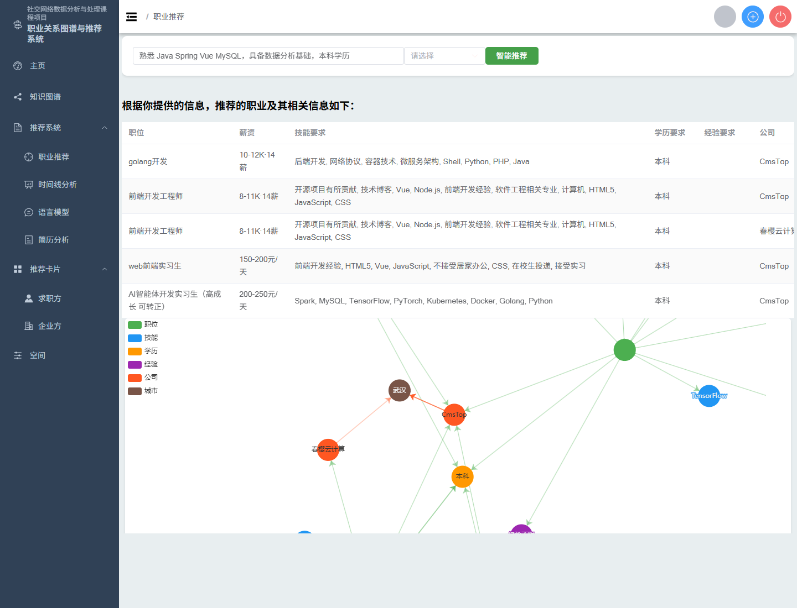
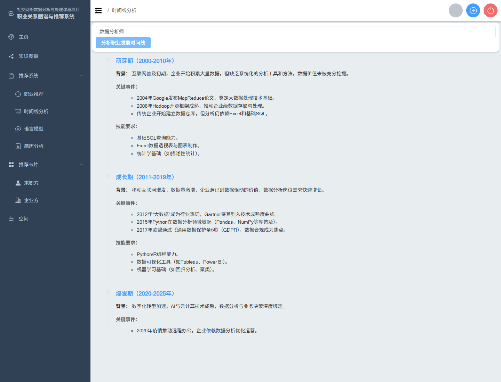

# 智能职位推荐系统_汇报_可编辑

- Source: `智能职位推荐系统_汇报_可编辑.pptx`
- Total slides: 18

## Slide 1

社交网络数据分析与处理

课程项目汇报

职业关系图谱与智能推荐系统

Job Relationship Graph & Intelligent Recommendation System

华中农业大学 · 信息学院

## Slide 2

项目概述与技术架构

01

系统定位 · 团队分工 · 整体架构 · 技术栈

核心功能演示

02

目 录

知识图谱 · 职业推荐 · 时间线分析 · AI问答 · 简历分析

CONTENTS

推荐算法与大模型

03

推荐流程 · 匹配评分 · 大语言模型集成

04

总结

02

## Slide 3

课程项目定位

PROJECT POSITIONING

项目背景与目标

知识图谱构建

◇

面向就业场景的关系网络分析与职业推荐系统。将岗位、公司、城市、技能、学历、经验等信息组织成知识图谱，结合检索、推荐和大语言模型问答，帮助用户理解职业要求和发展路径。

Neo4j图数据库存储实体关系

智能推荐引擎

○

多维匹配评分与Top-K排序

803条岗位数据

6类实体节点

AI辅助分析

△

大模型驱动问答与简历解析

5种关系类型

AI驱动推荐

03

## Slide 4

团队分工

TEAM WORK DISTRIBUTION

- 参考项目查阅
- 项目进度管理
- PPT制作/汇报

陈佳伸

- 项目实现/改进
- 功能测试
- 数据库设计与优化

黄泰

04

## Slide 5

系统整体架构

SYSTEM ARCHITECTURE

前端展示层

Vue 3

Element Plus

ECharts 5

FRONTEND

单页应用 · 动态路由 · 图谱可视化 · 响应式布局

▼

AI 分析引擎

Flask

DeepSeek-V3

Neo4j

AI SERVICE

推荐引擎 · 简历解析 · AI问答 · 时间线分析

▼

业务服务层

Spring Boot 3.4

MyBatis-Plus

JWT

BACKEND

用户管理 · 职位CRUD · 鉴权拦截 · 缓存加速

▼

数据存储层

MySQL 8.0

Neo4j

DATA LAYER

业务数据 · 会话缓存 · 图数据库

05

## Slide 6

技术栈总览

TECHNOLOGY STACK

前端技术

后端技术

AI与数据

Vue 3

Spring Boot 3.4

Flask

渐进式前端框架

Java业务后端

AI微服务框架

Element Plus

UI组件库

MyBatis-Plus 3.5

Neo4j

ORM框架

图数据库

ECharts 5

数据可视化图表

JWT + Argon2

认证与密码哈希

SiliconFlow API

大模型调用

Axios

HTTP客户端

MySQL 8.0

关系型数据库

06

## Slide 7

数据源与知识图谱建模

DATA SOURCE & KNOWLEDGE GRAPH MODELING

803

6

5

10+

岗位数据记录

实体节点类型

关系类型

数据字段

数据来源

图谱实体与关系

项目内置招聘岗位样本数据，共803条记录。数据字段包括：职位、城市、公司、学历、经验、技能、薪资、福利、工作描述和行业。数据用于课程项目演示与知识图谱建模。

Job 岗位

Company 公司

City 城市

Skill 技能

Degree 学历

Experience 经验

职位

城市

公司

学历

经验

关系：REQUIRES（需要）· BELONGS_TO（属于）· LOCATED_IN（位于）

技能

薪资

福利

工作描述

行业

07

## Slide 8

PART 02

核心功能演示

CORE FEATURES DEMONSTRATION

08

## Slide 9

知识图谱可视化

KNOWLEDGE GRAPH VISUALIZATION

6

5

803

ECharts

实体节点类型

关系类型

岗位数据

力导向图渲染

图谱功能说明

将招聘数据转化为图结构，展示岗位与技能、学历、经验、公司、城市之间的连接关系。节点颜色代表不同实体类型，连线表示实体间关系。相比传统表格，图谱更适合直观解释岗位要求之间的关联。

- 知识图谱可视化：岗位-技能-学历-经验-公司-城市关系网络
- （知识图谱可视化：岗位-技能-学历-经验-公司-城市关系网络）

- 核心特性：
- √ ECharts力导向图渲染，支持交互拖拽
- √ 节点按实体类型着色，直观区分
- √ 支持按条件筛选子图

09

## Slide 10

职业推荐系统

JOB RECOMMENDATION SYSTEM

1

用户输入描述

输入技能、学历、经验等自然语言

▼

- 推荐结果展示：岗位列表与关系图谱同步呈现
- （推荐结果展示：岗位列表与关系图谱同步呈现）

2

NLP关键词提取

技能/学历/经验实体识别

▼

3

图谱条件匹配

Neo4j查询满足条件的岗位

▼

4

匹配评分计算

匹配评分权重

技能命中+学历+经验+薪资匹配

技能命中

40%

▼

5

学历匹配

25%

Top-K排序输出

经验匹配

25%

推荐结果+图谱可视化解释

薪资匹配

10%

10

## Slide 11

职业时间线分析

CAREER TIMELINE ANALYSIS

AI模型根据职业名自动生成发展阶段分析，包括阶段名称、背景、关键事件和技能要求，以时间线组件直观展示职业成长路径。

初级阶段

0-2年

入门技能掌握，基础项目经验积累，在指导下完成工作任务

发展阶段

2-5年

- AI生成的职业发展四阶段时间线
- （AI生成的职业发展四阶段时间线）

专业技术深化，独立负责项目模块，开始指导初级成员

成熟阶段

5-10年

团队管理与跨领域协作，承担技术决策与架构设计职责

专家阶段

10年+

行业影响力建设，技术战略规划，跨团队技术领导

11

## Slide 12

AI 智能问答

AI INTELLIGENT Q&A

💬

📝

⚡

自然语言交互

Markdown渲染

SSE流式响应

用户使用日常语言提问职业发展和技能学习相关问题

AI回答以Markdown格式输出，支持代码高亮和公式渲染

Server-Sent Events实现逐字实时输出，交互体验流畅

🧠

🎯

🤖

上下文理解

职业领域专长

大模型驱动

支持多轮对话，理解用户意图并给出针对性建议

针对职业发展、技能学习路径等领域进行优化

接入DeepSeek-V3等先进模型，回答质量高

12

## Slide 13

简历智能分析

RESUME INTELLIGENT ANALYSIS

简历上传与解析

AI分析输出

PDF

职业名称

PyMuPDF (fitz) 提取

匹配度最高的职业方向

匹配概率

Word

基于简历内容的匹配评分

python-docx 提取

市场状况

图片

该职业当前市场需求分析

pytesseract OCR识别

发展行情

上传简历 → 自动识别格式 → 提取文本内容 → AI模型分析 → 生成职业匹配建议

职业发展前景与薪资趋势

13

## Slide 14

PART 03

推荐算法与大模型

ALGORITHM & LLM INTEGRATION

14

## Slide 15

推荐算法流程

RECOMMENDATION ALGORITHM FLOW

STEP

用户输入自我描述

评分权重

01

用户输入技能、学历、经验等自然语言描述

技能命中

40%

▼

学历匹配

25%

STEP

NLP关键词提取

02

技能/学历/经验实体识别与提取

经验匹配

25%

▼

薪资匹配

10%

STEP

Neo4j图数据库查询

03

条件查询与匹配岗位数据

▼

STEP

多维匹配评分计算

算法特点

04

技能命中 + 学历匹配 + 经验匹配 + 薪资匹配

- √ 基于图谱匹配，可解释性强
- √ 多维度综合评分，避免单一指标
- √ Top-K排序，结果精简高效

▼

STEP

Top-K排序输出

05

推荐结果 + 图谱解释可视化

15

## Slide 16

大语言模型集成

LLM INTEGRATION

AI 职业问答

职业时间线

简历智能匹配

SSE流式响应，实时逐字输出

根据职业名自动生成阶段

多格式简历文本提取

Markdown格式渲染回答

包含背景和关键事件

AI生成职业匹配分析

支持代码高亮和公式

技能要求随阶段变化

匹配概率量化评估

多轮对话上下文理解

时间线组件直观展示

市场行情与前景预测

技术实现说明

本项目通过 OpenAI 兼容接口接入第三方大模型服务（当前使用 SiliconFlow 平台），调用 DeepSeek-V3 模型。不同功能模块使用不同的 Prompt 模板组织输入和输出格式，AI 返回 Markdown 格式内容，由前端渲染成时间线、问答卡片和分析报告。

16

## Slide 17

PART 04

总结

SUMMARY

17

## Slide 18

项目亮点与成果

PROJECT HIGHLIGHTS

✓

✓

完整演示闭环

可解释推荐

注册登录 → 知识图谱 → 推荐 → 时间线 → 问答 → 简历分析，全流程本地可运行

基于图谱匹配而非黑盒模型，推荐结果可追溯、可解释，每个推荐都有关系依据

✓

✓

AI增强分析

多维度可视化

大语言模型补充传统图谱查询不足，AI生成职业发展解释、问答和简历分析建议

ECharts力导向图 + Element Plus表格/时间线/卡片，多组件协同呈现数据洞察

18
